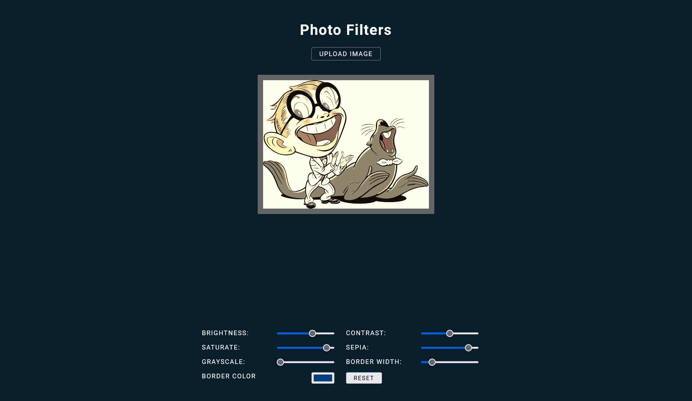

# Photo Filters

## Description

This webpage has couple of filters for you to play around on your own photo.

## What I have learned/ Challenge / Future add on

1. This project is inspired by one of the #JavaScript30 challenge by Wes Bos. (https://youtu.be/AHLNzv13c2I)

2. I want the user to upload their own photo instead of I hard code one on the webpage. As I haven't learn PHP yet so I have to do it with vanilla JS, and I found this tutorial by Webtrickshome, awesome! (https://www.webtrickshome.com/faq/how-to-display-uploaded-image-in-html-using-javascript)

3. I am having trouble to reset the value and photo when click the reset button, thanks Coding Curry's tutorial, I am able to solve it, thanks! (https://www.youtube.com/watch?v=frtfFfgrsk0)  

